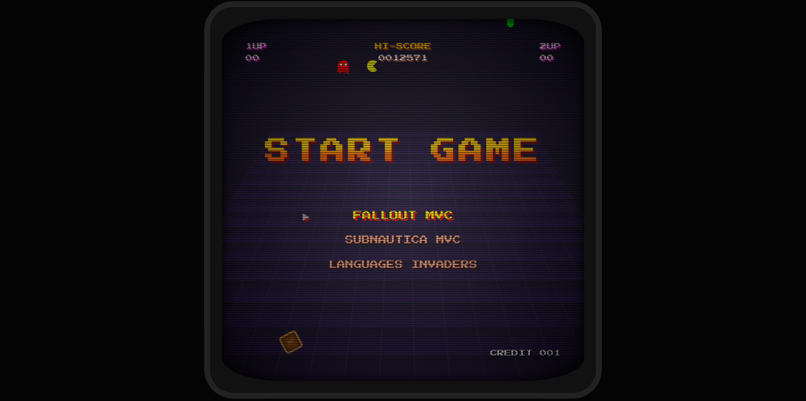
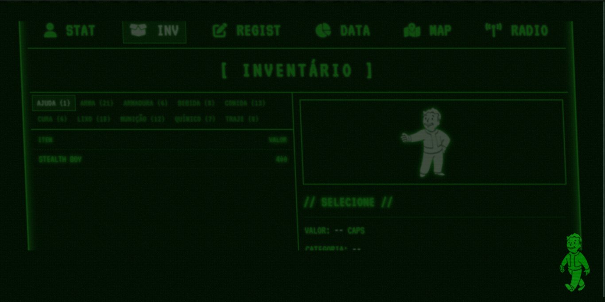
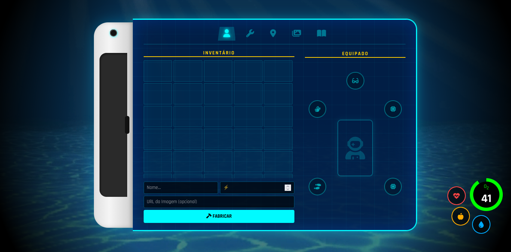
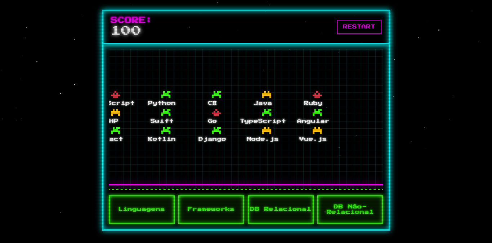

# Game UI Collection: Retro & Immersive Interfaces


> **Uma coleção de interfaces web interativas e sistemas de gerenciamento (CRUD) baseados na estética de jogos clássicos e modernos.**

## Sobre o Projeto

Este monorepo reúne experimentos de **Design de Interface (UI/UX)** e **Engenharia de Software**. O objetivo foi fugir do padrão "Bootstrap" corporativo e criar sistemas funcionais de gerenciamento de dados imersos em interfaces temáticas.

O projeto serve como um "Hub Arcade", onde uma simulação de monitor CRT permite navegar entre as diferentes aplicações.


*Interface principal simulando um monitor CRT com scanlines e navegação via teclado.*

---

## Projetos Integrados (Por enquanto)

### 1. ☢️ Fallout Pip-Boy Manager (MVC)
Um sistema de gerenciamento de dados (CRUD) completo, construído sob a arquitetura **MVC (Model-View-Controller)**, mas renderizado como se fosse um **Pip-Boy 3000**.

* **Conceitos:** Arquitetura MVC, Manipulação de DOM Avançada.
* **Destaques Visuais:**
    * Tela de Loading animada com o "Vault Boy" andando.
    * Efeitos de distorção de tela (CRT distortion) e coloração monocromática verde fósforo.
    * Sons de interface fiéis ao jogo.



### 2. 🌊 Subnautica PDA System (MVC)
Sistema de cadastro e visualização de dados inspirado no **PDA da Alterra Corporation** (Subnautica).

* **Conceitos:** Design Responsivo, Transparências e Blur (Glassmorphism), Gestão de Estados.
* **Destaques Visuais:**
    * HUD funcional com indicadores (Oxigênio, Profundidade).
    * Estética limpa e futurista, contrastando com o projeto Fallout.
    * Background animado simulando o fundo do mar.



### 3. 👾 Language Invaders
Um jogo interativo estilo "Space Invaders" focado em tecnologias.

* **Mecânica:** *Drag-down shooter*. O jogador deve destruir naves inimigas representadas por Logos de Linguagens, Bancos de Dados e Frameworks.
* **Conceitos:** Lógica de Game Loop, Colisão de elementos, Animações via CSS/JS.



---

## Tecnologias e Conceitos Aplicados

### Front-end Criativo
* **CSS3 Avançado:** Uso intenso de `keyframes`, `transform`, filtros SVG para distorção e pseudo-elementos (`::before`, `::after`) para criar scanlines e brilhos de tela.
* **CRT Simulation:** Técnicas de sobreposição de divs para simular a curvatura e as falhas de imagem de monitores antigos.

### Engenharia de Software
* **Arquitetura MVC:** Separação clara de responsabilidades nos projetos Fallout e Subnautica:
    * **Model:** Gerenciamento dos dados (Array/Local Storage).
    * **View:** Renderização da interface temática.
    * **Controller:** Lógica de negócios e intermédio entre o usuário e os dados.
* **JavaScript (ES6+):** Uso de Arrow Functions, Event Listeners para navegação por teclado e manipulação dinâmica de classes.

---

## Estrutura de Pastas

```bash
Game-UI-Collection/
│
├── index.html              # O "Arcade" (Menu Principal)
├── style.css               # Estilos globais e efeitos CRT
├── assets/                 # Imagens e fontes globais
│
├── MVC_Gerenciador_fallout/
│   ├── Front-end_version/  # Interface Pip-Boy
│   └── MVC/                # Estrutura Lógica
│
├── MVC_Subnautica/         # Interface PDA
│
└── LANGUAGES_INVADERS/     # Jogo Shooter

```

# Autor

<div align="center">
  <a href="https://github.com/Vinicius3442">
    
  </a>

  <br />
  
  <h3>Vinícius Montuani</h3>

  <p>
    <em>Estudante de Desenvolvimento de Sistemas @ SENAI</em>
  </p>

  <br />

  <a href="https://www.linkedin.com/in/vinicius-montuani" target="_blank">
    
  </a>
  <a href="https://github.com/Vinicius3442" target="_blank">
    
  </a>
</div>
